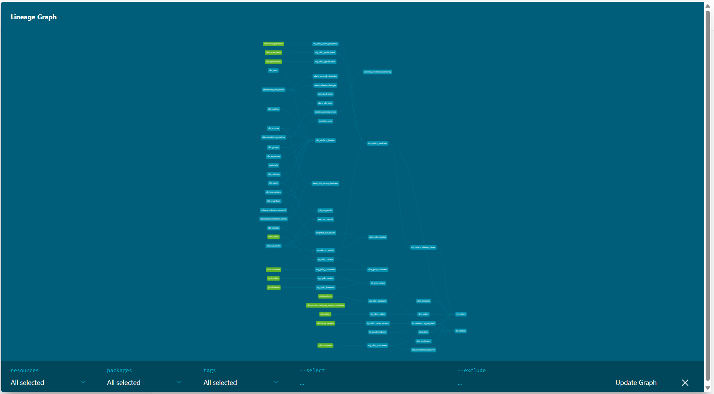
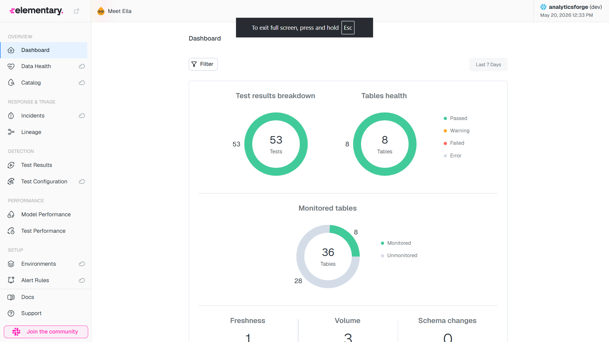

# AnalyticsForge

> A production-style data warehouse and analytics engineering portfolio project built with dbt Core, Snowflake, and Metabase. Demonstrates end-to-end analytics engineering across ingestion, modeling, testing, documentation, observability, and BI.

---

### Dashboard Pages (Offline Exports)

Full dashboard pages exported as MHTML files — download and open in Chrome for the complete interactive view:

- 📊 [Executive Overview](docs/Executive%20Overview.mhtml)
- 👥 [Customer Analytics](docs/Customer%20Analytics.mhtml)
- 📦 [Product Performance](docs/Product%20Performance.mhtml)
- 🏪 [Seller Analytics](docs/Seller%20Analytics.mhtml)
- 🚚 [Delivery & Operations](docs/Delivery%20%26%20Operations.mhtml)

---

## Architecture
Raw CSV Files (Kaggle Olist + Snowflake TPC-H)
↓
Python Ingestion → Snowflake RAW.OLIST
↓
dbt Staging Layer (stg_) → views
↓
dbt Intermediate Layer (int_) → views
↓
dbt Mart Layer (fct_* + dim_*) → tables
↓
Metabase Dashboard + Elementary Observability



---

## Tech Stack

| Layer | Tool |
|---|---|
| Cloud Warehouse | Snowflake (free trial) |
| Transformation | dbt Core 1.11 |
| Data Ingestion | Python + snowflake-connector-python |
| Observability | Elementary Data |
| CI/CD | GitHub Actions |
| Documentation | dbt docs + GitHub Pages |
| BI Dashboard | Metabase (Docker) |
| SQL Linting | sqlfluff |
| Version Control | Git + GitHub |

---

## Dataset

**Primary:** [Olist Brazilian E-Commerce](https://www.kaggle.com/datasets/olistbr/brazilian-ecommerce) — 100,000+ real orders from 2016–2018

| Table | Rows |
|---|---|
| orders | 99,441 |
| order_items | 112,650 |
| order_payments | 103,886 |
| order_reviews | 99,224 |
| customers | 99,441 |
| sellers | 3,095 |
| products | 32,951 |
| geolocation | 1,000,163 |

**Secondary:** TPC-H (Snowflake native) — 1,500,000 orders, 150,000 customers

---

## Dimensional Model
fct_orders ──→ dim_customers
──→ dim_sellers
──→ dim_products
──→ dim_date
fct_reviews ──→ fct_orders
──→ dim_customers
──→ dim_date

---

## Project Structure
analyticsforge/
├── ingestion/          # Python scripts to load CSVs into Snowflake
├── models/
│   ├── staging/        # One model per source — clean, typed, renamed
│   ├── intermediate/   # Business logic, joins, derived fields
│   └── marts/          # Star schema — facts and dimensions
├── macros/             # Custom dbt macros
├── snapshots/          # SCD Type 2 on dim_customers
├── seeds/              # Brazilian public holidays, category translations
├── tests/              # Singular data quality tests
├── exposures/          # Dashboard consumer documentation
├── docs/               # Architecture diagrams, dashboard screenshots
└── .github/workflows/  # CI/CD pipelines

---

## dbt Project Stats

| Metric | Count |
|---|---|
| Models | 52 |
| Tests | 118+ |
| Sources | 12 |
| Macros | 4 |
| Snapshots | 1 |
| Seeds | 1 |
| Packages | 4 |

---

## Data Observability

Elementary monitors configured on all mart models:
- Volume anomaly detection on `fct_orders` and `fct_reviews`
- Freshness anomaly detection on `fct_orders` and `dim_customers`
- Column anomaly monitoring on `review_score` and `order_total_value`



---

## CI/CD

Every pull request triggers:
- `dbt compile` — validates all SQL
- `dbt run + test` — runs and tests all layers
- `sqlfluff lint` — enforces SQL style

Every merge to main triggers:
- Full `dbt run + test`
- `dbt docs generate`
- Auto-deploy to GitHub Pages

---

## Dashboard

Built in Metabase consuming only the mart layer:

| Page | Description |
|---|---|
| Executive Overview | KPIs, revenue trend, order status |
| Customer Analytics | Orders by state, top cities, customer growth |
| Product Performance | Top/bottom categories, review scores, freight |
| Seller Analytics | Top sellers, delivery by state, review scores |
| Delivery & Operations | Late delivery trends, SLA analysis, review correlation |

---

## Key Business Findings

See [findings.md](findings.md) for 7 detailed business insights discovered in the data.

---

## dbt Documentation

Browse the full data catalog with model descriptions, column definitions, lineage graph, and test coverage:

🔗 **[Live dbt Docs](https://tar7nic.github.io/AnalyticsForge/)**

---

## Setup

### Prerequisites
- Python 3.11+
- Snowflake account
- dbt-core + dbt-snowflake
- Docker (for Metabase)

### Installation

```bash
# Clone the repo
git clone https://github.com/tar7nic/AnalyticsForge.git
cd AnalyticsForge

# Create virtual environment
python -m venv venv
source venv/bin/activate  # Windows: venv\Scripts\activate

# Install Python dependencies
pip install -r ingestion/requirements.txt

# Set up environment variables
cp .env.example .env
# Fill in your Snowflake credentials in .env

# Install dbt packages
dbt deps

# Load raw data
python ingestion/load_olist.py

# Run dbt
dbt seed
dbt run
dbt test
```

---

## Author

**Tarun Nichwani**
- GitHub: [@tar7nic](https://github.com/tar7nic)

---
